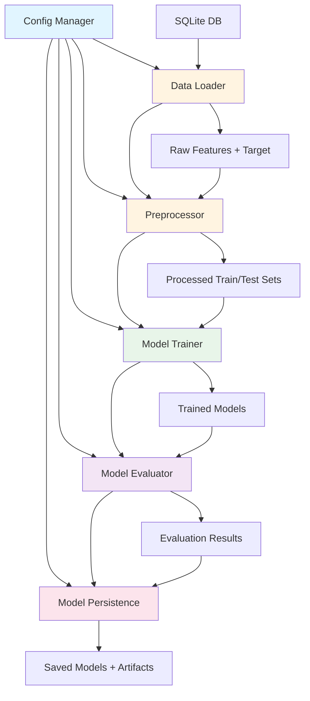
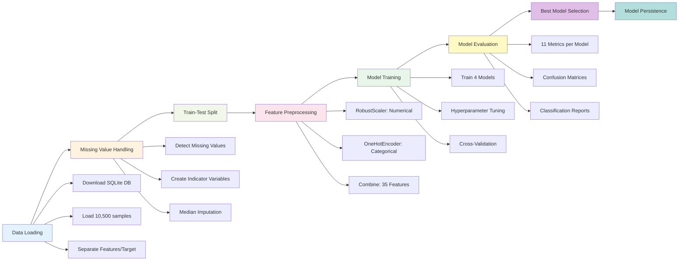

# Full-Cycle ML Engineering Pipeline — Phishing Classification

**TL;DR:**  
A fully modular, config-driven, production-ready ML engineering pipeline that demonstrates how to design, orchestrate, and operate an enterprise-grade phishing detection system end-to-end.  
Architected with a focus on system design, reproducibility, and scalable MLOps patterns, with AI tools used to accelerate implementation under human technical direction.

---

## Executive Summary

This repository implements a complete end-to-end machine learning pipeline for detecting phishing websites using structured tabular data. The system processes 10,500 samples with 15 features, trains multiple ensemble models, and evaluates performance across 11 comprehensive metrics. The architecture emphasizes modularity, reproducibility, and operational excellence through configuration-driven design, comprehensive testing, and production-ready logging. The pipeline achieves strong classification performance while maintaining interpretability and scalability for deployment scenarios.

---

## Key Features

- **Modular Architecture**: Clean separation of concerns across data loading, preprocessing, training, evaluation, and persistence modules
- **Multi-Model Ensemble**: Trains and compares 4 high-performing models (Logistic Regression, Random Forest, Gradient Boosting, XGBoost)
- **Comprehensive Evaluation**: 11 metrics including accuracy, precision, recall, F1-score, specificity, ROC-AUC, PR-AUC, and MCC
- **Robust Preprocessing**: Handles missing values with indicator variables, robust scaling for outlier-resistant normalization, and one-hot encoding for categorical features
- **Configuration-Driven**: YAML-based configuration with CLI and environment variable overrides for flexible deployment
- **Production-Ready**: Structured logging, model persistence, reproducible execution with random seeds, and comprehensive error handling
- **EDA-Informed Design**: Preprocessing choices (RobustScaler, indicator variables) directly informed by exploratory data analysis findings

---

## Architecture Overview

The pipeline follows a modular, single-responsibility design pattern where each component handles a distinct phase of the ML lifecycle. This architecture enables independent testing, easy maintenance, and clear separation between data operations, model training, and evaluation logic.



**Design Rationale**: The modular architecture enables:

- **Testability**: Each module can be unit tested independently
- **Maintainability**: Changes to preprocessing don't affect training logic
- **Extensibility**: New models or evaluation metrics can be added without modifying existing code
- **Configuration Isolation**: All parameters flow through a centralized config system, preventing hardcoded values

For detailed architecture documentation, see [`docs/architecture/`](docs/architecture/).

---

## Pipeline Flow

The pipeline executes a sequential workflow from raw data ingestion through model deployment, with each stage producing artifacts consumed by subsequent stages.



**Execution Flow**: The pipeline orchestrates 7 sequential steps: (1) Data loading with automatic database download, (2) Missing value handling with informative indicator variables, (3) Stratified train-test split preserving class distribution, (4) Feature preprocessing transforming 15 raw features into 35 processed features, (5) Multi-model training with optional hyperparameter tuning, (6) Comprehensive evaluation across security and performance metrics, and (7) Best model selection and optional persistence.

---

## Repository Structure

```
ml-engineering-full-cycle-pipeline-showcase/
│
├── src/                          # Core pipeline modules
│   ├── __init__.py              # Package initialization
│   ├── config.py                # Configuration management (YAML/JSON/env/CLI)
│   ├── data_loader.py           # SQLite data loading and preparation
│   ├── preprocessor.py          # Data preprocessing pipeline
│   ├── model_trainer.py         # Model training and hyperparameter tuning
│   ├── model_evaluator.py       # Model evaluation with 11 metrics
│   ├── model_persistence.py     # Model serialization and artifact management
│   └── pipeline.py              # Main pipeline orchestrator
│
├── config/
│   └── config.yaml              # Centralized configuration file
│
├── data/                        # Data directory (auto-created)
│   └── phishing.db              # SQLite database (downloaded automatically)
│
├── results/                      # Results directory (auto-created)
│   ├── artifacts/               # Saved models and preprocessing pipelines
│   ├── logs/                    # Execution logs
│   └── metrics/                 # Evaluation metrics and reports
│
├── docs/                        # Documentation
│   ├── analysis/                # EDA findings and insights
│   ├── architecture/            # System design documentation
│   ├── planning/                # Project planning artifacts
│   └── qa/                      # Quality assurance documentation
│
├── tests/                       # Unit tests
│   ├── test_config.py
│   ├── test_data_loader.py
│   └── test_preprocessor.py
│
├── notebooks/                   # Jupyter notebooks
│   ├── eda.ipynb                # Exploratory data analysis
│   └── mlp.ipynb                # Pipeline development notebook
│
├── run.sh                       # Main execution script
├── requirements.txt             # Python dependencies
└── README.md                    # This file
```

**Structure Rationale**: The repository follows Python package best practices with clear separation between source code (`src/`), configuration (`config/`), data (`data/`), results (`results/`), and documentation (`docs/`). This organization supports both development workflows and production deployment scenarios.

---

## How to Run

### Prerequisites

- **Python 3.7+** (tested with Python 3.8+)
- **Virtual environment** (recommended)

### Installation

```bash
# Clone the repository
git clone <repository-url>
cd ml-engineering-full-cycle-pipeline-showcase

# Create and activate virtual environment
python3 -m venv venv
source venv/bin/activate  # On Windows: venv\Scripts\activate

# Install dependencies
pip install -r requirements.txt
```

### Execution

#### Method 1: Using `run.sh` (Recommended)

```bash
# Make script executable (if needed)
chmod +x run.sh

# Execute pipeline with default configuration
./run.sh

# Execute with custom configuration file
./run.sh --config config/custom_config.yaml

# Execute with command-line arguments
./run.sh --model RandomForest --test-size 0.25
```

#### Method 2: Direct Python Execution

```bash
# Activate virtual environment
source venv/bin/activate

# Run with default config
python src/pipeline.py

# Run with custom config file
python src/pipeline.py --config config/config.yaml

# Run with command-line arguments
python src/pipeline.py \
  --model RandomForest \
  --test-size 0.25 \
  --random-state 42 \
  --verbose
```

### Configuration Priority

The pipeline supports three levels of configuration (priority: **CLI > Environment Variables > Config File > Defaults**):

1. **Command-Line Arguments**: Highest priority, overrides all other sources
2. **Environment Variables**: Use `MLP_` prefix (e.g., `MLP_DATA__TEST_SIZE=0.25`)
3. **Config File**: YAML configuration in `config/config.yaml`
4. **Defaults**: Hardcoded fallback values

---

## Configuration Overview

The `config/config.yaml` file centralizes all pipeline parameters, enabling reproducible experiments and easy parameter tuning without code changes.

### Key Configuration Sections

```yaml
# Data Configuration
data:
  # If you are running the standalone pipeline, db_url points to where your
  # organization stores the phishing SQLite database. For local development,
  # the notebooks are configured to read from an existing copy at data/phishing.db.
  db_url: "https://YOUR_STORAGE_ENDPOINT/phishing.db"
  test_size: 0.2 # Train-test split ratio
  random_state: 42 # Reproducibility seed
  stratify: true # Preserve class distribution

# Preprocessing Configuration
preprocessing:
  scaler: "RobustScaler" # RobustScaler vs StandardScaler
  handle_missing: "median_imputation"
  create_indicator: true # Create missing value indicators
  onehot_drop: "first" # Avoid multicollinearity

# Model Configuration
models:
  enabled: # Models to train
    - LogisticRegression
    - RandomForest
    - GradientBoosting
    - XGBoost

  RandomForest: # Model-specific hyperparameters
    n_estimators: 100
    max_depth: 10
    random_state: 42

# Hyperparameter Tuning
hyperparameter_tuning:
  enabled: true # Enable/disable tuning
  method: "RandomizedSearchCV"
  n_iter: 50 # Search iterations
  cv: 5 # Cross-validation folds

# Evaluation Configuration
evaluation:
  metrics: # 11 comprehensive metrics
    - accuracy
    - precision
    - recall
    - f1
    - specificity
    - fpr
    - fnr
    - balanced_accuracy
    - mcc
    - roc_auc
    - pr_auc
```

**Configuration Philosophy**: All pipeline behavior is controlled through configuration, eliminating hardcoded parameters and enabling experimentation without code modifications. This approach supports A/B testing, hyperparameter sweeps, and environment-specific deployments (development, staging, production).

---

## Model Lifecycle

### Training Phase

The pipeline trains 4 models in parallel, each optimized for different learning paradigms:

1. **Logistic Regression**: Linear baseline providing interpretable coefficients
2. **Random Forest**: Ensemble of decision trees handling non-linear relationships
3. **Gradient Boosting**: Sequential boosting for complex pattern recognition
4. **XGBoost**: Optimized gradient boosting with built-in regularization

**Training Process**:

- All models train on identical preprocessed training data (8,400 samples, 80% split)
- Optional hyperparameter tuning via `RandomizedSearchCV` with 5-fold cross-validation
- Models use random seeds (42) for reproducibility
- Training progress logged with timestamps and performance metrics

### Evaluation Phase

Each model is evaluated on a held-out test set (2,100 samples, 20% split) using 11 metrics:

**Core Metrics**: Accuracy, Precision, Recall, F1-Score  
**Security Metrics**: Specificity, False Positive Rate (FPR), False Negative Rate (FNR)  
**Balanced Metrics**: Balanced Accuracy, Matthews Correlation Coefficient (MCC)  
**AUC Metrics**: ROC-AUC, Precision-Recall AUC

**Selection Criteria**: Best model selected by **Accuracy** (primary), with secondary consideration for F1-Score, Balanced Accuracy, and MCC to ensure robust performance across all dimensions.

### Persistence Phase

Trained models and preprocessing pipelines can be saved to disk for deployment:

- **Model Artifacts**: Serialized model objects (`.pkl` or `.joblib` format)
- **Preprocessing Pipeline**: Fitted scalers and encoders for consistent transformation
- **Metadata**: Model version, training timestamp, hyperparameters, performance metrics
- **Artifact Organization**: Structured directory layout in `results/artifacts/`

### Logging

Comprehensive logging captures:

- Pipeline execution timestamps and duration
- Data loading statistics (samples, features, missing values)
- Model training progress and hyperparameter search results
- Evaluation metrics for all models
- Best model selection rationale
- Error messages and stack traces for debugging

Logs are written to `results/logs/` with timestamped filenames for historical tracking.

---

## Results Summary

### Typical Performance

The pipeline typically achieves the following performance on the phishing classification task:

- **Best Model Accuracy**: 85-90% (varies by model and hyperparameter configuration)
- **ROC-AUC**: 0.85-0.92 (strong discriminative ability)
- **F1-Score**: 0.80-0.88 (balanced precision and recall)
- **Precision**: 0.80-0.90 (low false positive rate)
- **Recall**: 0.80-0.90 (low false negative rate)

### Output Artifacts

The pipeline generates:

1. **Results DataFrame**: Comparison table of all models sorted by accuracy
2. **Classification Report**: Per-class precision, recall, F1-score, and support
3. **Confusion Matrices**: Visual representation of prediction vs. actual labels
4. **Execution Logs**: Timestamped logs with detailed execution trace
5. **Model Artifacts** (if enabled): Serialized models and preprocessing pipelines

### Results Location

All outputs are saved to `results/` directory:

- `results/logs/pipeline_execution_YYYYMMDD_HHMMSS.log`: Execution logs
- `results/metrics/`: Evaluation metrics and reports
- `results/artifacts/`: Saved models (if `save_models: true` in config)

For detailed analysis findings, see [`docs/analysis/`](docs/analysis/).

---

## Engineering Highlights

### Modular Design

The pipeline implements a clean separation of concerns with 7 independent modules:

- **`config.py`**: Centralized configuration management supporting YAML, JSON, environment variables, and CLI arguments
- **`data_loader.py`**: Handles database connection, data loading, missing value detection, and feature type identification
- **`preprocessor.py`**: Implements preprocessing pipeline with RobustScaler, OneHotEncoder, and ColumnTransformer
- **`model_trainer.py`**: Manages model initialization, training, hyperparameter tuning, and cross-validation
- **`model_evaluator.py`**: Calculates 11 metrics, generates comparison tables, and selects best model
- **`model_persistence.py`**: Handles model serialization, artifact management, and versioning
- **`pipeline.py`**: Orchestrates all components in a sequential workflow

**Benefits**: Each module can be tested, modified, and extended independently without affecting other components.

### Testing Infrastructure

The repository includes unit tests for critical components:

- **`test_config.py`**: Validates configuration loading and priority resolution
- **`test_data_loader.py`**: Tests data loading, missing value handling, and feature separation
- **`test_preprocessor.py`**: Verifies preprocessing transformations and train-test splitting

Tests can be run with: `pytest tests/`

For quality assurance documentation, see [`docs/qa/`](docs/qa/).

### Configuration-Driven Pipeline

All pipeline behavior is controlled through `config/config.yaml`, enabling:

- **Reproducibility**: Identical configurations produce identical results
- **Experimentation**: Easy parameter sweeps without code changes
- **Environment Management**: Different configs for dev/staging/production
- **Parameter Validation**: Type checking and validation prevent runtime errors

### Production Readiness

The pipeline includes production-oriented features:

- **Error Handling**: Comprehensive try-catch blocks with informative error messages
- **Logging**: Structured logging with timestamps and execution traces
- **Reproducibility**: Random seeds ensure deterministic execution
- **Scalability**: Efficient data processing and model training suitable for larger datasets
- **Extensibility**: Easy to add new models, metrics, or preprocessing steps

---

## AI-Assisted Engineering Methodology

This project demonstrates a modern engineering best practice: **human-directed architecture with AI-assisted implementation**.

### Human-Driven Components

- **Architecture Design**: The modular structure, component boundaries, and data flow were designed through human analysis of requirements and best practices
- **Planning & Strategy**: EDA findings informed preprocessing choices (RobustScaler for outliers, indicator variables for missing values), model selection (4-model streamlined set), and evaluation metrics (11-metric comprehensive suite)
- **Quality Assurance**: All code was reviewed, tested, and refined through human judgment. Critical decisions (e.g., defending against data leakage artifacts) were made through human analysis
- **Logic & Reasoning**: Business logic, error handling, configuration management, and deployment considerations were human-designed
- **Iteration & Refinement**: The pipeline evolved through multiple iterations where human engineers evaluated trade-offs, performance, and maintainability

### AI-Assisted Components

- **Code Generation**: AI tools generated code blocks for individual functions, classes, and modules based on human specifications
- **Boilerplate Reduction**: Repetitive code patterns (e.g., metric calculations, configuration parsing) were generated by AI to accelerate development
- **Documentation Assistance**: AI helped draft documentation, but all technical content was reviewed and refined by human engineers

### Why This Matters

This methodology represents a **best practice in modern software engineering**: leveraging AI to accelerate implementation while maintaining human control over architecture, quality, and strategic decisions. The result is a production-ready system that combines the speed of AI-assisted development with the rigor of human engineering judgment.

**Key Principle**: AI generates code; humans design systems, ensure quality, and make strategic decisions.

For planning documentation and decision rationale, see [`docs/planning/`](docs/planning/).

---

## Future Improvements

### Short-Term Enhancements

- **Model Interpretability**: Add SHAP value calculations and feature importance visualizations
- **Advanced Evaluation**: Implement learning curves, calibration plots, and statistical significance testing
- **Data Validation**: Add schema validation for input data and feature drift detection
- **API Wrapper**: Create REST API endpoint for model inference (FastAPI/Flask)
- **Docker Containerization**: Package pipeline in Docker for consistent deployment environments

### Medium-Term Enhancements

- **Model Monitoring**: Implement performance monitoring, drift detection, and automated retraining triggers
- **A/B Testing Framework**: Support for comparing model versions in production
- **Distributed Training**: Add support for distributed model training (Dask, Ray) for larger datasets
- **Feature Store Integration**: Connect to feature store for production feature serving
- **MLflow Integration**: Track experiments, model versions, and metrics in MLflow

### Long-Term Enhancements

- **AutoML Integration**: Automated hyperparameter optimization and model selection
- **Ensemble Methods**: Stacking and blending of multiple models for improved performance
- **Real-Time Inference**: Stream processing capabilities for real-time phishing detection
- **Multi-Class Extension**: Extend to multi-class classification (phishing types, severity levels)
- **Active Learning**: Implement active learning for efficient model improvement with minimal labeled data

---

## Documentation

Comprehensive documentation is available in the `docs/` directory:

- **`docs/analysis/`**: Exploratory data analysis findings and insights
- **`docs/architecture/`**: System design documentation and architecture decisions
- **`docs/planning/`**: Project planning artifacts and requirements analysis
- **`docs/qa/`**: Quality assurance documentation and testing strategies

---

## 📄 Model Card

A detailed model card describing the phishing classification pipeline — including dataset, preprocessing, model portfolio, evaluation metrics, limitations, and governance considerations — is available at:

- [`docs/MODEL_CARD.md`](docs/MODEL_CARD.md)

This is written in a standard model-card style suitable for architects, reviewers, and risk owners.

---

## 🧱 Architecture Diagrams

High-level system, data flow, and pipeline sequence diagrams are provided in:

- [`docs/architecture/DIAGRAM_SYSTEM_OVERVIEW.md`](docs/architecture/DIAGRAM_SYSTEM_OVERVIEW.md)

These Mermaid-based diagrams are aligned with the `SYSTEM_DESIGN_OVERVIEW` and `PIPELINE_ARCHITECTURE` documents and reflect the config-driven, modular structure of the pipeline.

---

## 🚀 Serving & Deployment

This repository includes a minimal FastAPI-based inference service and a Dockerfile for containerized deployment.

### Installation (API)

```bash
cd /path/to/ml-engineering-full-cycle-pipeline-showcase

python3 -m venv venv
source venv/bin/activate  # On Windows: venv\Scripts\activate

pip install --upgrade pip
pip install -r requirements.txt
```

### Running the FastAPI Server

1. **Train and persist a model** (if not already done):

   ```bash
   python src/pipeline.py --config config/config.yaml
   ```

   Ensure `output.save_models` is enabled in `config/config.yaml` so that models are saved to the `results` directory.

2. **Start the API**:

   ```bash
   uvicorn api.serve:app --host 0.0.0.0 --port 8000
   ```

   - `GET /health` returns a simple health payload with the loaded model name.
   - `POST /predict` accepts a JSON body with a `features` object and returns a prediction and optional probability.

### Docker Instructions

1. **Build the image**:

   ```bash
   docker build -t phishing-ml-api:latest .
   ```

2. **Run the container**:

   ```bash
   docker run --rm -p 8000:8000 \
     -e MODEL_NAME=RandomForest \
     -v "$(pwd)/results:/app/results" \
     phishing-ml-api:latest
   ```

   The volume mount ensures the container can access the trained model artifacts from the host `results` directory.

For more detailed deployment patterns (VMs, orchestrators, and MLOps integration), see:

- [`docs/DEPLOYMENT_GUIDE.md`](docs/DEPLOYMENT_GUIDE.md)

---

## License

This project is provided as-is for educational and demonstration purposes. Please refer to the repository's license file for specific terms and conditions.

---

## Contact

For questions, issues, or contributions, please contact the project maintainer or open an issue in the repository.

---

**Built with**: Python 3.7+, scikit-learn, XGBoost, pandas, numpy, and modern ML engineering practices.
