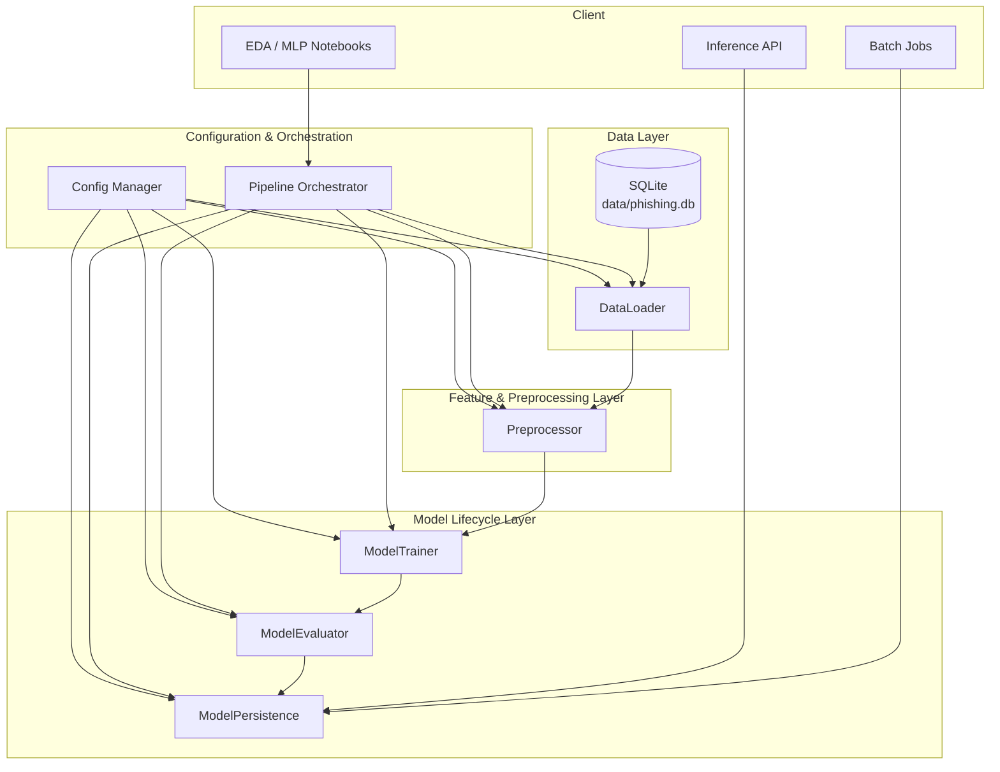
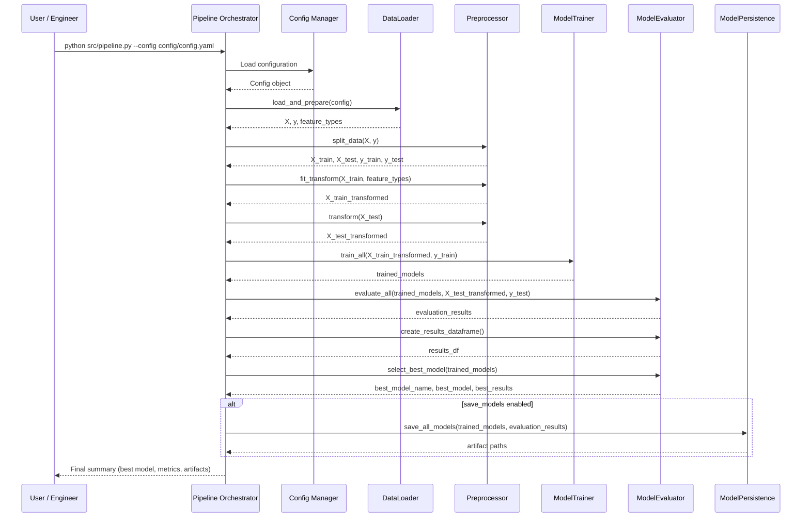

# System Overview Diagrams — Phishing Classification Pipeline

This document contains Mermaid diagrams capturing the core architecture, data flow, and pipeline sequence for the phishing classification ML system.

---

## 1. System Architecture Diagram



---

## 2. Data Flow Diagram

```mermaid
flowchart LR
    A[Local SQLite DB<br/>data/phishing.db] --> B[DataLoader<br/>(load & basic cleaning)]
    B --> C[Feature/Target Split]
    C --> D[Preprocessor<br/>(RobustScaler + OneHotEncoder)]
    D --> E[Train/Test Split<br/>(stratified)]
    E --> F[ModelTrainer<br/>(train portfolio)]
    F --> G[ModelEvaluator<br/>(compute metrics)]
    G --> H[Best Model Selection]
    H --> I[ModelPersistence<br/>(save models & metadata)]

    subgraph Config
        CFGYAML[config/config.yaml]
    end

    CFGYAML --> B
    CFGYAML --> D
    CFGYAML --> F
    CFGYAML --> G
    CFGYAML --> I
```

---

## 3. Pipeline Sequence Diagram



All diagrams assume a **config-driven pipeline** where behavior is controlled via `config/config.yaml` and optionally overridden by environment variables or CLI arguments.
