# Pipeline Architecture: Execution Flow & Operational Design

## 1. Purpose of the Pipeline

The Machine Learning Pipeline is a production-ready, end-to-end system designed to automate the complete ML lifecycle from raw data ingestion through model deployment. The pipeline addresses the critical need for reproducible, scalable, and maintainable machine learning workflows in enterprise environments.

**Primary Objectives**:
- **Automate ML Workflow**: Eliminate manual steps in data preparation, model training, and evaluation
- **Ensure Reproducibility**: Deterministic execution with configuration-driven parameters and random seed management
- **Enable Experimentation**: Easy parameter sweeps and model comparisons without code modifications
- **Support Production Deployment**: Model persistence, comprehensive logging, and error handling for operational readiness
- **Maintain Quality**: Comprehensive evaluation metrics and best model selection for reliable predictions

**Use Cases**:
- **Phishing Detection**: Binary classification of websites as phishing or legitimate (current implementation)
- **General Binary Classification**: Extensible to other binary classification tasks (fraud detection, spam filtering, etc.)
- **Model Comparison**: Evaluate multiple models simultaneously to identify optimal algorithms
- **Hyperparameter Optimization**: Automated hyperparameter tuning with cross-validation
- **Research & Development**: Rapid experimentation with different preprocessing strategies and model architectures

---

## 2. End-to-End Flow Diagram

```mermaid
flowchart TD
    START([Pipeline Start]) --> INIT[Initialize Configuration]
    INIT --> VALIDATE{Config Valid?}
    VALIDATE -->|No| ERROR1[Configuration Error]
    VALIDATE -->|Yes| STEP1[Step 1: Data Loading]
    
    STEP1 --> DL1[Download Database]
    DL1 --> DL2[Connect to SQLite]
    DL2 --> DL3[Load DataFrame]
    DL3 --> DL4[Separate Features/Target]
    DL4 --> DL5[Handle Missing Values]
    DL5 --> DL6[Identify Feature Types]
    DL6 --> STEP2[Step 2: Preprocessing]
    
    STEP2 --> PP1[Stratified Train-Test Split]
    PP1 --> PP2[Create Preprocessing Pipeline]
    PP2 --> PP3[Fit on Training Data]
    PP3 --> PP4[Transform Train & Test]
    PP4 --> STEP3[Step 3: Model Training]
    
    STEP3 --> MT1[Initialize Models]
    MT1 --> MT2{Hyperparameter<br/>Tuning?}
    MT2 -->|Yes| MT3[RandomizedSearchCV]
    MT3 --> MT4[Train with Best Params]
    MT2 -->|No| MT4
    MT4 --> MT5{Cross-Validation?}
    MT5 -->|Yes| MT6[5-Fold CV]
    MT5 -->|No| STEP4[Step 4: Model Evaluation]
    MT6 --> STEP4
    
    STEP4 --> EV1[Generate Predictions]
    EV1 --> EV2[Calculate 11 Metrics]
    EV2 --> EV3[Create Results DataFrame]
    EV3 --> EV4[Select Best Model]
    EV4 --> STEP5[Step 5: Final Validation & Reporting]
    
    STEP5 --> ASSESS1[Classification Report]
    ASSESS1 --> ASSESS2[Confusion Matrix]
    ASSESS2 --> STEP6{Save Models?}
    
    STEP6 -->|Yes| STEP7[Step 6: Model Persistence]
    STEP6 -->|No| SUCCESS[Pipeline Complete]
    STEP7 --> PERS1[Serialize Models]
    PERS1 --> PERS2[Save Metadata]
    PERS2 --> PERS3[Save Preprocessor]
    PERS3 --> SUCCESS
    
    ERROR1 --> END([Pipeline Failed])
    SUCCESS --> END
    
    style START fill:#e8f5e9
    style SUCCESS fill:#c8e6c9
    style ERROR1 fill:#ffcdd2
    style END fill:#f0f0f0
    style STEP1 fill:#e3f2fd
    style STEP2 fill:#fff3e0
    style STEP3 fill:#e8f5e9
    style STEP4 fill:#f3e5f5
    style STEP5 fill:#fff9c4
    style STEP7 fill:#b2dfdb
```



**Flow Characteristics**:
- **Sequential Execution**: Each step depends on outputs from previous steps
- **Conditional Branches**: Optional steps (hyperparameter tuning, model persistence) controlled by configuration
- **Error Propagation**: Errors at any stage halt execution with informative messages
- **State Preservation**: Intermediate results stored for debugging and analysis

---

## 3. Detailed Step-by-Step Explanation

### Step 1: Data Loading

**Purpose**: Ingest raw data from SQLite database and prepare it for preprocessing.

**Sub-steps**:

1. **Configuration Loading**
   - Load database URL and local path from config
   - Validate configuration parameters
   - Set up data directory structure

2. **Database Download** (if needed)
   - Check if local database file exists
   - If not, download from remote URL using `urllib.request`
   - Handle download errors with retry logic

3. **Database Connection**
   - Connect to SQLite database using `sqlite3`
   - Query table names to identify data table
   - Handle connection failures gracefully

4. **Data Loading**
   - Execute SQL query: `SELECT * FROM {table_name}`
   - Load into pandas DataFrame
   - Remove index columns if present (e.g., `Unnamed: 0`)

5. **Feature-Target Separation**
   - Identify target column (`isPhishing` or similar)
   - Separate into `X` (features) and `y` (target)
   - Validate that target column exists

6. **Missing Value Handling**
   - Detect columns with missing values
   - For informative missingness (e.g., `LineOfCode`), create indicator variable
   - Impute missing values with median (robust to outliers)
   - Log missing value statistics

7. **Feature Type Identification**
   - Automatically identify numerical vs categorical features
   - Numerical: integer or float dtypes
   - Categorical: object/string dtypes with low cardinality
   - Return feature type dictionary

**Inputs**: Configuration object, database URL  
**Outputs**: `X` (DataFrame), `y` (Series), `feature_types` (dict)  
**Error Handling**: Database connection failures, missing columns, empty datasets  
**Logging**: Dataset shape, missing value counts, feature type counts

---

### Step 2: Preprocessing

**Purpose**: Transform raw features into model-ready format and split data into train/test sets.

**Sub-steps**:

1. **Train-Test Split**
   - Use `train_test_split` with stratification
   - Preserve class distribution in both sets
   - Default: 80% train, 20% test (configurable)
   - Use random seed (42) for reproducibility

2. **Preprocessing Pipeline Creation**
   - Initialize `ColumnTransformer` with feature-specific transformers
   - Numerical features: `RobustScaler` (median-centered, IQR-scaled)
   - Categorical features: `OneHotEncoder` (drop='first' to avoid multicollinearity)
   - Configure `handle_unknown='ignore'` for production robustness

3. **Fit Preprocessing Pipeline**
   - Fit `ColumnTransformer` on training data only
   - Learn scaling parameters (median, IQR) from training set
   - Learn one-hot encoding categories from training set
   - **Critical**: Never fit on test data to prevent data leakage

4. **Transform Data**
   - Transform training data: `fit_transform(X_train)`
   - Transform test data: `transform(X_test)` (using fitted parameters)
   - Combine numerical and categorical features into unified matrix
   - Result: 15 raw features → 35 processed features

**Inputs**: `X`, `y`, `feature_types`, configuration  
**Outputs**: `X_train_transformed`, `X_test_transformed`, `y_train`, `y_test`  
**Error Handling**: Empty data, mismatched lengths, unknown scaler types  
**Logging**: Split sizes, class distributions, transformation shapes

**Key Design Decision**: Fitting only on training data prevents data leakage, ensuring test set remains truly held-out for unbiased evaluation.

---

### Step 3: Model Training

**Purpose**: Train multiple machine learning models with optional hyperparameter tuning.

**Sub-steps**:

1. **Model Initialization**
   - Read enabled models from configuration
   - Initialize each model with config-specified hyperparameters
   - Set random seeds for reproducibility
   - Handle optional dependencies (XGBoost, LightGBM)

2. **Hyperparameter Tuning** (optional, if enabled)
   - For each model, define hyperparameter search space
   - Use `RandomizedSearchCV` with 5-fold cross-validation
   - Search `n_iter` combinations (default: 50)
   - Select best hyperparameters based on validation score
   - Log best parameters and validation scores

3. **Model Training**
   - Train each model on `X_train_transformed`, `y_train`
   - Use best hyperparameters from tuning (if enabled)
   - Track training time for each model
   - Handle convergence warnings and errors

4. **Cross-Validation** (optional, if enabled)
   - Perform 5-fold cross-validation on training data
   - Calculate mean and std of CV scores
   - Log CV results for model comparison

5. **Model Storage**
   - Store trained models in dictionary: `{model_name: model_object}`
   - Preserve model metadata (hyperparameters, training time)

**Inputs**: `X_train_transformed`, `y_train`, configuration  
**Outputs**: `trained_models` (dict), training logs  
**Error Handling**: Model import failures, convergence errors, memory issues  
**Logging**: Training progress, hyperparameter search results, CV scores, training times

**Key Design Decision**: Optional hyperparameter tuning balances performance optimization with execution speed. Disabled for rapid iteration, enabled for production models.

---

### Step 4: Model Evaluation

**Purpose**: Evaluate all trained models comprehensively and select the best model.

**Sub-steps**:

1. **Prediction Generation**
   - For each trained model:
     - Generate binary predictions: `predict(X_test_transformed)`
     - Generate probability predictions: `predict_proba(X_test_transformed)`
   - Store predictions for metric calculation

2. **Metric Calculation**
   - Calculate 11 metrics per model:
     - **Core**: Accuracy, Precision, Recall, F1-Score
     - **Security**: Specificity, False Positive Rate (FPR), False Negative Rate (FNR)
     - **Balanced**: Balanced Accuracy, Matthews Correlation Coefficient (MCC)
     - **AUC**: ROC-AUC, Precision-Recall AUC
   - Handle edge cases (e.g., single-class predictions)

3. **Results Compilation**
   - Create results dictionary: `{model_name: {metric: value}}`
   - Convert to pandas DataFrame for easy comparison
   - Sort by accuracy (primary criterion)
   - Log results table

4. **Best Model Selection**
   - Select model with highest accuracy
   - Apply secondary criteria (F1-Score, Balanced Accuracy, MCC) if accuracy ties
   - Store best model name, object, and results
   - Log selection rationale

5. **Detailed Reports**
   - Generate classification report (per-class precision, recall, F1)
   - Create confusion matrix
   - Calculate per-class metrics

**Inputs**: `trained_models`, `X_test_transformed`, `y_test`, configuration  
**Outputs**: `evaluation_results` (dict), `results_df` (DataFrame), `best_model_name`, `best_model`, `best_results`  
**Error Handling**: Prediction failures, metric calculation errors, empty predictions  
**Logging**: All metrics per model, results comparison table, best model summary

**Key Design Decision**: 11-metric evaluation provides holistic view of model performance. Accuracy as primary criterion (balanced dataset), with secondary metrics ensuring robust performance across dimensions.

---

### Step 5: Final Validation & Reporting

**Purpose**: Generate comprehensive summary of pipeline execution and model performance.

**Sub-steps**:

1. **Classification Report Generation**
   - Generate per-class metrics (precision, recall, F1, support)
   - Format as readable text report
   - Log to console and file

2. **Summary Statistics**
   - Best model name and type
   - Best model accuracy and key metrics
   - Comparison with other models
   - Training time summary

3. **Final Output**
   - Print execution summary
   - Log completion status
   - Store results for potential downstream use

**Inputs**: Evaluation results, best model information  
**Outputs**: Classification report, summary statistics, execution logs  
**Error Handling**: Report generation failures  
**Logging**: Final summary, best model details, execution duration

---

### Step 6: Model Persistence (Optional)

**Purpose**: Save trained models and preprocessing pipelines for deployment.

**Sub-steps**:

1. **Model Serialization**
   - Serialize each trained model using `pickle`
   - Save to `results/artifacts/{model_name}_model.pkl`
   - Handle serialization errors

2. **Metadata Storage**
   - Extract model metadata (hyperparameters, metrics, timestamp)
   - Save as JSON: `results/artifacts/{model_name}_metadata.json`
   - Include training configuration for reproducibility

3. **Preprocessor Persistence**
   - Serialize fitted preprocessing pipeline
   - Save to `results/artifacts/preprocessor.pkl`
   - Required for consistent feature transformation in production

4. **Artifact Organization**
   - Create structured directory layout
   - Ensure all artifacts are versioned (via timestamps or version numbers)
   - Log artifact paths

**Inputs**: `trained_models`, `evaluation_results`, configuration  
**Outputs**: Serialized model files, metadata files, preprocessor file  
**Error Handling**: Serialization failures, disk space issues, permission errors  
**Logging**: Artifact paths, file sizes, metadata contents

**Key Design Decision**: Optional persistence controlled by configuration flag. Disabled during experimentation to avoid disk clutter, enabled for production deployment.

---

## 4. Error Handling Strategy

### 4.1 Error Handling Philosophy

The pipeline implements a **fail-fast with informative errors** strategy. Errors are caught at appropriate levels, logged with context, and propagated with actionable error messages.

### 4.2 Error Categories

#### Configuration Errors

**Location**: `config.py`, `pipeline.py` (main)

**Error Types**:
- Missing configuration file
- Invalid YAML/JSON syntax
- Missing required parameters
- Invalid parameter values (e.g., test_size > 1.0)

**Handling**:
```python
try:
    config = Config(config_path=args.config, args=args)
except Exception as e:
    print(f"❌ ERROR: Failed to load configuration: {e}")
    sys.exit(1)
```

**User Action**: Fix configuration file or provide valid CLI arguments.

---

#### Data Loading Errors

**Location**: `data_loader.py`

**Error Types**:
- Database download failures (network issues, invalid URL)
- Database connection failures (file not found, corrupted database)
- Missing tables or columns
- Empty datasets

**Handling**:
```python
try:
    urllib.request.urlretrieve(self.db_url, self.temp_db_path)
except Exception as e:
    raise RuntimeError(f"Failed to download database from {self.db_url}: {e}")
```

**User Action**: Check network connectivity, verify database URL, ensure database integrity.

---

#### Preprocessing Errors

**Location**: `preprocessor.py`

**Error Types**:
- Empty input data
- Mismatched X and y lengths
- Unknown scaler types
- Preprocessor not fitted before transform

**Handling**:
```python
if X.empty:
    raise ValueError("Input data is empty - cannot split")
if len(X) != len(y):
    raise ValueError(f"X and y have mismatched lengths: {len(X)} vs {len(y)}")
```

**User Action**: Verify input data, ensure preprocessor is fitted before transform.

---

#### Model Training Errors

**Location**: `model_trainer.py`

**Error Types**:
- Missing optional dependencies (XGBoost, LightGBM)
- Model convergence failures
- Memory exhaustion during training
- Invalid hyperparameter values

**Handling**:
```python
try:
    import xgboost as xgb
except ImportError:
    raise ImportError("XGBoost not available. Install with: pip install xgboost")
```

**User Action**: Install missing dependencies, adjust hyperparameters, increase available memory.

---

#### Evaluation Errors

**Location**: `model_evaluator.py`

**Error Types**:
- No evaluation results available (evaluate_all not called)
- Prediction failures
- Metric calculation errors (e.g., single-class predictions)

**Handling**:
```python
if not self.evaluation_results:
    raise ValueError("No evaluation results available. Run evaluate_all() first.")
```

**User Action**: Ensure models are evaluated before accessing results.

---

#### Persistence Errors

**Location**: `model_persistence.py`

**Error Types**:
- Serialization failures
- Disk space exhaustion
- Permission errors
- Model file not found (during load)

**Handling**:
```python
if not os.path.exists(model_path):
    raise FileNotFoundError(f"Model file not found: {model_path}")
```

**User Action**: Check disk space, verify permissions, ensure model was saved.

---

### 4.3 Error Propagation Strategy

**Level 1: Component-Level Error Handling**
- Each component catches and handles domain-specific errors
- Raises descriptive exceptions with context

**Level 2: Pipeline-Level Error Handling**
- Pipeline orchestrator catches all exceptions
- Logs full traceback for debugging
- Provides user-friendly error messages
- Exits with non-zero status code

**Level 3: User-Level Error Handling**
- `run.sh` script captures exit codes
- Logs errors to file for later analysis
- Provides execution status summary

### 4.4 Error Recovery

**Current Strategy**: Fail-fast (no automatic recovery)

**Rationale**: ML pipelines require data integrity. Automatic recovery risks silent failures and incorrect results.

**Future Enhancement**: Add retry logic for transient errors (network failures, temporary file locks).

---

## 5. Logging and Metrics

### 5.1 Logging Strategy

**Logging Levels**:
- **Verbose Mode** (default): Detailed progress at each step
- **Quiet Mode**: Only errors and final summary

**Logging Locations**:
- **Console**: Real-time progress indicators
- **File**: Timestamped log files in `results/logs/pipeline_execution_YYYYMMDD_HHMMSS.log`

**Logging Content**:

1. **Pipeline Initialization**
   - Configuration summary
   - Database URL, test size, random state
   - Enabled models list

2. **Data Loading**
   - Dataset shape (samples × features)
   - Missing value statistics
   - Feature type counts (numerical vs categorical)

3. **Preprocessing**
   - Train-test split sizes and class distributions
   - Preprocessing pipeline components
   - Transformation shapes (before/after)

4. **Model Training**
   - Model initialization status
   - Hyperparameter tuning progress (if enabled)
   - Training time per model
   - Cross-validation results (if enabled)

5. **Model Evaluation**
   - All metrics per model
   - Results comparison table
   - Best model selection rationale

6. **Final Summary**
   - Best model name and accuracy
   - Execution duration
   - Artifact locations (if persistence enabled)

**Log Format**:
```
======================================================================
SECTION HEADER
======================================================================
✓ Success message
📊 Statistics: value
❌ Error message
```

### 5.2 Metrics Tracking

**Evaluation Metrics** (11 per model):
- **Accuracy**: Overall correctness
- **Precision**: Of predicted positives, how many are correct?
- **Recall**: Of actual positives, how many are detected?
- **F1-Score**: Harmonic mean of precision and recall
- **Specificity**: Of actual negatives, how many are correctly identified?
- **FPR**: False positive rate (false alarms)
- **FNR**: False negative rate (missed threats)
- **Balanced Accuracy**: Average of sensitivity and specificity
- **MCC**: Matthews Correlation Coefficient (comprehensive metric)
- **ROC-AUC**: Area under ROC curve
- **PR-AUC**: Area under Precision-Recall curve

**Metrics Storage**:
- In-memory: `evaluation_results` dictionary
- Structured: `results_df` pandas DataFrame
- File: JSON metadata (if persistence enabled)

**Metrics Logging**:
- Results DataFrame printed to console
- Saved to `results/metrics/` (future enhancement)
- Included in model metadata JSON

### 5.3 Observability

**Current State**: Basic logging and metrics

**Future Enhancements**:
- **Structured Logging**: JSON format for log aggregation tools
- **Metrics Dashboard**: Real-time visualization of training progress
- **Performance Profiling**: Track execution time per component
- **Resource Monitoring**: CPU, memory, disk usage
- **Integration**: MLflow, Weights & Biases, TensorBoard

---

## 6. Model Persistence Strategy

### 6.1 Persistence Philosophy

Models are persisted to enable:
- **Deployment**: Load models in production inference services
- **Versioning**: Track model versions and performance over time
- **Reproducibility**: Reload exact models used in experiments
- **Rollback**: Revert to previous model versions if needed

### 6.2 Artifact Structure

```
results/artifacts/
├── {model_name}_model.pkl          # Serialized model object
├── {model_name}_metadata.json      # Hyperparameters, metrics, timestamp
├── preprocessor.pkl                 # Fitted preprocessing pipeline
└── config_snapshot.yaml            # Configuration used for training (future)
```

### 6.3 Serialization Format

**Models**: Pickle (`.pkl`)
- **Pros**: Preserves full Python object state, works with scikit-learn models
- **Cons**: Python version dependency, security concerns (only load trusted files)

**Metadata**: JSON (`.json`)
- **Pros**: Human-readable, language-agnostic, version-control friendly
- **Cons**: Limited to JSON-serializable types

**Future Enhancement**: Consider `joblib` for large models (more efficient than pickle).

### 6.4 Metadata Contents

```json
{
  "model_name": "RandomForest",
  "hyperparameters": {
    "n_estimators": 100,
    "max_depth": 10,
    "random_state": 42
  },
  "metrics": {
    "accuracy": 0.89,
    "precision": 0.87,
    "recall": 0.91,
    "f1": 0.89,
    ...
  },
  "training_timestamp": "2025-12-01T16:38:17",
  "training_duration_seconds": 12.5,
  "config_snapshot": {...}
}
```

### 6.5 Versioning Strategy

**Current**: Timestamp-based (implicit versioning via timestamps)

**Future Enhancement**: Explicit version numbers (semantic versioning)
- `v1.0.0`: Initial model
- `v1.1.0`: Retrained with new data
- `v2.0.0`: Architecture change (new features, different preprocessing)

### 6.6 Model Loading for Inference

**Production Workflow**:
```python
# Load preprocessor
with open('results/artifacts/preprocessor.pkl', 'rb') as f:
    preprocessor = pickle.load(f)

# Load model
with open('results/artifacts/RandomForest_model.pkl', 'rb') as f:
    model = pickle.load(f)

# Transform new data
X_new_transformed = preprocessor.transform(X_new)

# Predict
y_pred = model.predict(X_new_transformed)
```

**Critical**: Preprocessor must be loaded and used for consistent feature transformation.

---

## 7. MLOps Readiness

### 7.1 CI/CD Integration

**Current State**: Basic execution script (`run.sh`)

**CI/CD Integration Points**:

1. **Automated Testing**
   ```yaml
   # GitHub Actions / GitLab CI example
   - name: Run Pipeline Tests
     run: pytest tests/
   
   - name: Execute Pipeline
     run: ./run.sh --config config/config.yaml
   
   - name: Validate Results
     run: python scripts/validate_results.py
   ```

2. **Model Validation**
   - Check that best model accuracy exceeds threshold
   - Validate that all models completed training
   - Ensure no errors in execution logs

3. **Artifact Upload**
   - Upload trained models to model registry
   - Store execution logs and metrics
   - Tag artifacts with git commit hash

**Future Enhancement**: Full CI/CD pipeline with automated model validation, deployment, and rollback.

---

### 7.2 Feature Store Integration

**Current State**: Data loaded directly from SQLite

**Feature Store Integration**:

1. **Feature Retrieval**
   ```python
   # Replace DataLoader with Feature Store client
   from feature_store import FeatureStoreClient
   
   client = FeatureStoreClient()
   X = client.get_features(entity_ids, feature_list)
   ```

2. **Feature Versioning**
   - Use feature store versioning for reproducibility
   - Track feature lineage (which features used in training)

3. **Online/Offline Features**
   - Training: Use offline feature store (historical data)
   - Inference: Use online feature store (real-time features)

**Integration Points**:
- Replace `data_loader.py` database connection with feature store client
- Maintain same interface (`load_and_prepare()` method)
- Add feature version tracking to metadata

---

### 7.3 Model Registry Integration

**Current State**: Local file-based persistence

**Model Registry Integration**:

1. **Model Registration**
   ```python
   # MLflow example
   import mlflow
   
   mlflow.set_tracking_uri("http://mlflow-server:5000")
   mlflow.log_model(model, "RandomForest")
   mlflow.log_metrics(evaluation_results["RandomForest"])
   mlflow.log_params(hyperparameters)
   ```

2. **Model Versioning**
   - Automatic versioning in model registry
   - Tag models with stages (staging, production)
   - Track model lineage (training data version, code version)

3. **Model Deployment**
   - Promote models from staging to production
   - A/B testing between model versions
   - Automatic rollback on performance degradation

**Integration Points**:
- Extend `model_persistence.py` with registry client
- Add registry upload after local persistence
- Include git commit hash and data version in metadata

---

### 7.4 Monitoring & Observability

**Current State**: Basic logging

**Production Monitoring**:

1. **Model Performance Monitoring**
   - Track prediction accuracy over time
   - Detect model drift (performance degradation)
   - Alert on threshold violations

2. **Data Drift Detection**
   - Monitor feature distributions
   - Alert on significant distribution shifts
   - Trigger retraining if drift detected

3. **System Health Monitoring**
   - Pipeline execution time
   - Resource usage (CPU, memory, disk)
   - Error rates and failure modes

**Integration Points**:
- Add monitoring hooks in `pipeline.py`
- Send metrics to monitoring service (Prometheus, Datadog)
- Create dashboards for visualization

---

### 7.5 Automated Retraining

**Current State**: Manual retraining required

**Automated Retraining Pipeline**:

1. **Trigger Conditions**
   - Scheduled (daily, weekly, monthly)
   - Performance degradation (accuracy drops below threshold)
   - Data drift detected
   - New data available

2. **Retraining Workflow**
   ```yaml
   # Airflow DAG example
   - Load new data from feature store
   - Execute pipeline with new data
   - Validate new model performance
   - Compare with current production model
   - If better: Deploy to staging → A/B test → Promote to production
   - If worse: Keep current model, alert team
   ```

3. **Model Comparison**
   - Compare new model metrics with current production model
   - Statistical significance testing
   - Business metric evaluation (if applicable)

**Integration Points**:
- Wrap pipeline execution in workflow orchestration (Airflow, Prefect)
- Add model comparison logic
- Integrate with model registry for deployment

---

## 8. Scalability Notes

### 8.1 Current Scalability Characteristics

**Dataset Size**: Optimized for 10K-100K samples

**Performance**:
- **Data Loading**: O(n) where n = number of samples (pandas efficient for < 1M rows)
- **Preprocessing**: O(n × m) where m = number of features (scikit-learn efficient)
- **Model Training**: Varies by model (RandomForest parallel, XGBoost efficient)
- **Evaluation**: O(n) for predictions, O(1) for metrics

**Memory Usage**:
- **Data Loading**: ~50-100 MB for 10K samples (pandas DataFrame)
- **Preprocessing**: ~100-200 MB (transformed arrays)
- **Model Training**: 100-500 MB per model (depends on model complexity)
- **Total**: ~1-2 GB for full pipeline execution

**Execution Time** (10K samples, 4 models):
- **Without hyperparameter tuning**: ~30-60 seconds
- **With hyperparameter tuning**: ~3-5 minutes

---

### 8.2 Scalability Limitations

**Current Limitations**:

1. **Single-Threaded Execution** (mostly)
   - Models train sequentially (except RandomForest `n_jobs=-1`)
   - No distributed training support

2. **Memory Constraints**
   - All data loaded into memory
   - No streaming/chunked processing
   - Large datasets may cause OOM errors

3. **Database Access**
   - Single SQLite connection
   - No connection pooling
   - Not optimized for large databases

4. **Feature Engineering**
   - All features processed in memory
   - No incremental preprocessing
   - Large feature sets may be slow

---

### 8.3 Scalability Improvements

#### Short-Term (Easy Wins)

1. **Parallel Model Training**
   ```python
   from concurrent.futures import ThreadPoolExecutor
   
   with ThreadPoolExecutor(max_workers=4) as executor:
       futures = {executor.submit(train_model, model, X, y): model 
                  for model in models}
   ```
   - Train multiple models in parallel
   - Reduces training time by ~4x (for 4 models)

2. **Memory Optimization**
   - Use `dtype` optimization (float32 instead of float64)
   - Delete intermediate DataFrames after use
   - Use generators for large datasets

3. **Caching**
   - Cache preprocessed data to disk
   - Skip preprocessing if cache exists and data unchanged

#### Medium-Term (Moderate Effort)

1. **Distributed Training**
   - Integrate Dask or Ray for distributed model training
   - Scale to 100K+ samples
   - Support for larger hyperparameter search spaces

2. **Chunked Processing**
   - Process data in chunks for memory efficiency
   - Streaming preprocessing for large datasets
   - Incremental model training (for some algorithms)

3. **Database Optimization**
   - Connection pooling for multiple data sources
   - Query optimization for large databases
   - Support for distributed databases (Spark, BigQuery)

#### Long-Term (Significant Effort)

1. **Distributed Data Processing**
   - Apache Spark integration for 1M+ samples
   - Distributed feature engineering
   - Parallel data loading from multiple sources

2. **Model Parallelism**
   - Distribute large models across multiple machines
   - Support for deep learning models (if needed)
   - Model sharding for very large models

3. **Real-Time Processing**
   - Stream processing for real-time predictions
   - Online learning (incremental model updates)
   - Low-latency inference (< 100ms)

---

### 8.4 Scalability Recommendations

**For Current Use Case** (10K samples):
- ✅ Current implementation is adequate
- ✅ No immediate scalability concerns

**For 100K-1M Samples**:
- ⚠️ Consider parallel model training
- ⚠️ Optimize memory usage (dtype, chunking)
- ⚠️ Use distributed databases if needed

**For 1M+ Samples**:
- ❌ Requires distributed processing (Spark, Dask)
- ❌ Distributed model training
- ❌ Feature store for efficient feature retrieval
- ❌ Model registry for versioning and deployment

**For Production Deployment**:
- ✅ Current implementation suitable for batch inference
- ⚠️ Consider API wrapper for real-time inference
- ⚠️ Add monitoring and alerting
- ⚠️ Implement model versioning and rollback

---

## Conclusion

This pipeline architecture provides a solid foundation for production ML workflows. The modular design, comprehensive error handling, and detailed logging enable reliable execution and easy debugging. While current scalability is adequate for moderate datasets, the architecture supports extension to distributed processing and real-time inference through well-defined integration points.

**Key Strengths**:
- **Reproducibility**: Configuration-driven with random seed management
- **Observability**: Comprehensive logging and metrics
- **Extensibility**: Clear integration points for MLOps tools
- **Reliability**: Robust error handling and validation

**Future Enhancements**:
- Distributed training for larger datasets
- Real-time inference API
- Automated retraining and deployment
- Advanced monitoring and drift detection

The pipeline is ready for production deployment with appropriate MLOps tooling integration.

---

**Document Version**: 1.0  
**Last Updated**: 2025-12-01  
**Author**: Pipeline Architecture Team

