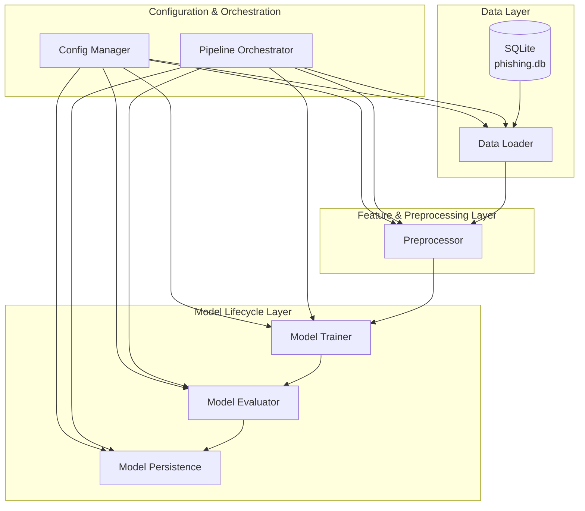

# System Architecture Overview — Full-Cycle ML Pipeline for Phishing Classification

## 1. Executive Summary

This document describes the architecture of a **full-cycle machine learning pipeline** for phishing website classification. The system ingests structured security telemetry from a SQLite data source, transforms it into model-ready features, trains and evaluates multiple models, and optionally persists artifacts for deployment. The design is driven by **modularity, reproducibility, observability, and operational readiness**, with clear separation between data, feature engineering, model lifecycle, and orchestration concerns.

---

## 2. System Context & Objectives

### 2.1 Problem Scope

The system addresses the problem of **binary classification of phishing vs. legitimate websites** using structured attributes such as code statistics, redirect counts, robots directives, responsiveness, industry, hosting provider, and domain age. The architecture is intentionally general enough to support other tabular security and fraud-detection workloads with minimal change.

### 2.2 Objectives

- **Functional**

  - Provide an end-to-end pipeline from data ingestion to evaluated models.
  - Support multiple modeling approaches in a single, comparable framework.
  - Enable straightforward promotion of the best-performing model into a deployed environment.

- **Non‑Functional**
  - **Scalability**: Handle tens of thousands of records comfortably on a single node, with a clear path to distributed execution.
  - **Reproducibility**: Ensure deterministic behavior via configuration and random seed management.
  - **Observability**: Expose each stage through structured logging and metrics.
  - **Testability**: Allow independent testing of data, preprocessing, and modeling components.
  - **Extensibility**: Make it easy to add new models, features, or integration points (MLOps, feature store, registries).

---

## 3. High‑Level Architecture Overview

### 3.1 Logical Architecture

At a conceptual level, configuration and orchestration sit above the data, feature, and model lifecycle layers. The pipeline orchestrator coordinates calls into each component according to configuration, while components themselves focus on a single responsibility.

### 3.2 Conceptual Data Flow

1. **Data Layer**: The system connects to a SQLite database, extracts the phishing dataset into a tabular structure, and separates features from labels.
2. **Feature Layer**: The preprocessor performs stratified splitting and applies robust scaling and categorical encoding to deliver a coherent numeric feature space.
3. **Model Lifecycle Layer**: Multiple models are trained on the engineered features, evaluated with a consistent metric suite, and (optionally) persisted alongside metadata and the preprocessing pipeline.
4. **Configuration & Orchestration**: All behavior (data paths, model selection, metrics, tuning options) is driven from configuration, ensuring predictable and repeatable runs.

---

## 4. Component Architecture

### 4.1 Data Loader (`data_loader.py`)

#### Responsibility

Provide a clean interface from the raw SQLite data source into in-memory tabular structures suitable for downstream processing.

#### Inputs

- Database URL and local path (from configuration).
- SQLite database file (`phishing.db`).

#### Outputs

- `X`: Features `DataFrame` with missing values handled.
- `y`: Target `Series` representing phishing vs. legitimate labels.
- `feature_types`: Mapping of feature names to `numerical` and `categorical` sets.

#### Constraints

- Must not embed model- or feature-engineering logic beyond basic missing-value strategy and type detection.
- Must tolerate absent local database (download on demand) and log schema information for audit.

#### Rationale

- Isolating data access ensures the pipeline can later be redirected to warehouses, APIs, or feature stores without modifying modeling code.
- Centralized handling of missingness and schema logging improves diagnosability and governance.

---

### 4.2 Preprocessor (`preprocessor.py`)

#### Responsibility

Transform raw tabular features into a model-ready numerical representation and manage the train/test split.

#### Inputs

- `X`, `y`, and `feature_types` from the data loader.
- Preprocessing configuration (scaler selection, one-hot encoding behavior).

#### Outputs

- `X_train_transformed`, `X_test_transformed`: Numeric matrices with all preprocessing applied.
- `y_train`, `y_test`: Labels aligned with transformed data.
- Fitted preprocessing pipeline (`ColumnTransformer`) that can be persisted and reused for inference.

#### Constraints

- Must avoid data leakage by fitting transformations only on training data and reusing them for test/inference.
- Must remain agnostic of downstream model choices.

#### Rationale

- Centralizing preprocessing ensures training and inference share identical transformations, which is essential for production correctness.
- Using scikit‑learn composable primitives (RobustScaler, OneHotEncoder, ColumnTransformer) allows the pipeline to be easily serialized and redeployed.

---

### 4.3 Model Trainer (`model_trainer.py`)

#### Responsibility

Instantiate and train multiple ML models on the preprocessed training data, with optional hyperparameter tuning and cross‑validation.

#### Inputs

- `X_train_transformed`, `y_train`.
- Model configuration (enabled models, hyperparameter grids, tuning settings).

#### Outputs

- `trained_models`: Dictionary mapping model names to fitted model objects.
- Training logs and, where configured, cross‑validation statistics.

#### Constraints

- Must not assume a single “best” model a priori; it trains all configured models consistently.
- Must surface dependency issues (e.g., missing XGBoost) as clear errors.

#### Rationale

- Decoupling training from evaluation enables independent experimentation with model portfolios and evaluation criteria.
- Treating models as interchangeable units simplifies integration with registries and deployment tools later.

---

### 4.4 Model Evaluator (`model_evaluator.py`)

#### Responsibility

Evaluate trained models on held‑out data, compute metrics, and identify the best model for deployment.

#### Inputs

- `trained_models` from the trainer.
- `X_test_transformed`, `y_test` from the preprocessor.
- Evaluation configuration (metric list, primary selection metric).

#### Outputs

- `evaluation_results`: Per‑model metric dictionaries.
- `results_df`: Tabular comparison of models and metrics.
- `best_model_name`, `best_model`, `best_results`: Selected model and its performance summary.

#### Constraints

- Must remain deterministic with respect to a given configuration and random seed.
- Must handle edge cases (e.g., degenerate predictions) gracefully.

#### Rationale

- Isolating evaluation logic clarifies how models are compared and selected, which is critical for governance and stakeholder communication.
- A standardized metric suite (including security‑oriented metrics) prevents ad‑hoc, non‑comparable evaluations across experiments.

---

### 4.5 Model Persistence (`model_persistence.py`)

#### Responsibility

Persist trained models and associated metadata to durable storage for later inference and governance.

#### Inputs

- `trained_models` and (optionally) `evaluation_results`.
- Output configuration (results directory, persistence flags).

#### Outputs

- Serialized model artifacts (e.g., `RandomForest_model.pkl`).
- JSON metadata files capturing metrics, hyperparameters, and timestamps.
- Optionally, serialized preprocessing pipeline.

#### Constraints

- Must not perform any training or evaluation.
- Must operate idempotently and fail clearly if artifacts already exist or storage is unavailable.

#### Rationale

- Separating persistence ensures that deployment tooling can consume artifacts without coupling to training code.
- Explicit metadata files support model governance, rollback, and audit.

---

## 5. Configuration & Orchestration Layer

**Config Manager (`config.py`)** centralizes configuration from four sources: defaults, YAML/JSON config file, environment variables, and CLI arguments. The pipeline uses this single configuration object throughout, avoiding hard‑coded parameters.

**Pipeline Orchestrator (`pipeline.py`)** coordinates all components. It:

- Initializes configuration and validates critical parameters.
- Executes the lifecycle in order: data loading → preprocessing → training → evaluation → optional persistence.
- Handles cross‑cutting concerns such as high‑level logging, error reporting, and summary output.

### 5.1 Why Config‑Driven Architecture

- **Reproducibility**: A `config.yaml` coupled with a commit hash fully defines a run, making results repeatable.
- **Auditability**: Configuration can be stored as part of metadata, allowing auditors to reconstruct environment and decision parameters.
- **Environment Parity**: CLI and environment overrides make it straightforward to use the same code across development, CI, and production with different settings.

---

## 6. Operational Concerns

### 6.1 Logging & Tracing

The pipeline emits structured, stage‑oriented logs covering:

- Dataset characteristics, schema, and missingness.
- Preprocessing pipeline configuration and transformed shapes.
- Model initialization, training durations, and (optionally) tuning activity.
- Evaluation metrics per model and best‑model selection.
- Final run summary, including any persistence actions.

Logs are written to the console and to timestamped files under `results/logs/`, enabling both interactive debugging and offline inspection.

### 6.2 Error Boundaries

- Components validate inputs and raise descriptive exceptions (e.g., empty data, mismatched lengths, unsupported scalers).
- The orchestrator catches top‑level exceptions, prints a user‑readable error plus a full traceback, and returns a non‑zero exit code.
- The shell wrapper (`run.sh`) treats non‑zero exits as failures, capturing logs for review.

This structure ensures failures are explicit and localizable, which is essential for production operations.

### 6.3 Deterministic Execution

- Random seeds are fixed for splitting, model initialization, and hyperparameter search where applicable.
- Configuration is the single source of truth for parameters like test size and model portfolio.

Determinism makes experiments comparable and greatly simplifies incident analysis.

### 6.4 Dependency Isolation

- Python dependencies are declared in `requirements.txt` and typically installed into a virtual environment.
- Optional model libraries (e.g., XGBoost, LightGBM) are detected and surfaced as clear import errors when missing.

This minimizes surprises across environments and makes the system amenable to containerization.

---

## 7. Security & Governance Considerations

### 7.1 Data Handling

- Data is read from a local SQLite database; no external calls are made at runtime in the evaluated configuration.
- Schema and basic statistics are logged for visibility but do not expose sensitive content.
- Missing‑value handling and feature typing are deterministic, simplifying audits of what the model actually saw.

### 7.2 Model Governance

- Metrics are computed consistently across runs, making it straightforward to justify model promotion decisions.
- When persistence is enabled, model artifacts and their metadata are stored with names that can incorporate timestamps and, in a fuller deployment, commit hashes or data version identifiers.
- The architecture is compatible with model registries; the persistence layer can be adapted to register models instead of or in addition to local writes.

### 7.3 Risk Mitigation

Key risks and mitigations:

- **Data drift and concept drift**: Handled at the architectural level by separating data, features, and models, and by making retraining a repeatable process.
- **Operational failures**: Mitigated via explicit error boundaries, deterministic logs, and clear exit codes.
- **Misconfiguration**: Reduced by centralizing configuration and providing defaults while keeping overrides explicit.

---

## 8. Scalability & Extensibility

### 8.1 Path Toward MLOps Frameworks

The existing module boundaries map cleanly onto managed MLOps offerings:

- **SageMaker / Vertex / Azure ML Pipelines**: Each component (`DataLoader`, `Preprocessor`, `Trainer`, `Evaluator`, `Persistence`) can become a pipeline step.
- **Experiment Tracking & Model Registry**: The evaluator and persistence layers can be extended to log metrics and artifacts directly into MLflow or native registries.

### 8.2 Feature Stores

Replacing the SQLite integration with a feature store client is straightforward because `DataLoader` exposes a simple contract: `load_and_prepare()` returns `X`, `y`, and `feature_types`. All downstream components remain unchanged when features come from a feature store rather than a local DB.

### 8.3 Deployment Pipelines

Persisted models and preprocessors can be consumed by:

- Batch scoring jobs that reuse the same preprocessing pipeline.
- Online inference services (FastAPI/Flask) that wrap preprocessor + model for real‑time scoring.

The clear delineation between training‑time code and artifacts makes CI/CD integration (build → test → train → validate → deploy) straightforward.

---

## 9. Trade‑Offs & Alternatives

### 9.1 Classical ML vs. Deep Learning

The architecture favors **classical, tree‑based and linear models** on engineered/tabular features rather than deep learning architectures. This is appropriate for:

- Tabular phishing telemetry with limited sample size.
- Teams that prioritize interpretability, cost‑efficiency, and operational simplicity.

Alternative: transformer‑based approaches over raw URLs/HTML/email could be integrated by replacing the feature layer while retaining the same orchestration and model lifecycle layers.

### 9.2 Single‑Node vs. Distributed Execution

The design targets a single‑node execution model with the option for parallelism within some models (e.g., Random Forest). Scaling to very large datasets would require:

- Swapping out the data and feature layers for Spark/Dask equivalents.
- Potentially moving model training to distributed libraries or managed training services.

The current abstractions make that migration additive rather than disruptive.

### 9.3 Config‑Driven vs. Code‑Driven Customization

Relying on configuration for behavior has clear benefits (reproducibility, auditability) at the cost of slightly more up‑front discipline. Ad‑hoc code edits can be faster in the very early stages, but they do not scale well across teams or environments. This architecture optimizes for the **team setting and long‑term maintainability**.

---

## 10. Conclusion

The phishing classification pipeline is architected as a **production‑ready ML system**, not a one‑off model. It cleanly separates data access, feature engineering, modeling, evaluation, and persistence, all under a config‑driven orchestration layer. This delivers:

- **Clarity**: Each component has a well‑defined responsibility and contract.
- **Reproducibility**: Runs are parameterized and deterministic, suitable for regulated environments.
- **Observability**: Logging and metrics expose behavior across the full lifecycle.
- **Extensibility**: The design can grow into managed MLOps platforms, feature stores, and deployment pipelines with minimal rework.

As a blueprint, this system reflects how an enterprise ML solution should be structured: clear boundaries, strong operational posture, and a straightforward path from experiment to production.
